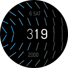

# Watchfaces for Amazfit Smart Watches

Different watchfaces I developed for my Amazfit GTR Mini (416x416 px).

## Development

### References

- [Zepp OS Watchface API](https://docs.zepp.com/docs/watchface/api/hmUI/createWidget/)

- [Official Watchface Maker](https://watchface.zepp.com/create)

- [GTR 4 Watchface Community on 4pda.to](https://4pda.to/forum/index.php?showtopic=1055207)

### How to Start Development

- [Quick start guide](https://docs.zepp.com/docs/guides/quick-start/)

## File Structure

This repositity has several folders -- one folder for one watchface

## How to Install a Watchface on Your Watch

To install a watchface to your smartwatch:

1. Go to [all releases page](https://github.com/novvember/amazfit-watchfaces/releases)

2. Find latest release, download `.zip` file and transfer it to your phone

3. Use any app, which can install Amazfit watchfaces from phone internal storage

## List of Watchfaces

| Image 	                    | Name       	| Development Status 	  |
|:-------------------------:  |------------ |--------------------- |
|   | Text Lines 	| ✅ Done             	|
|        	| Spin       	| ✅ Done             	|
|    | Particles  	| 🚫 Has issues        |
|       	| Gauge      	| ✅ Done             	|
|       | Bourne     	| ✅ Done             	|
|      | Celeste    	| ✅ Done             	|

