# Watchfaces for Amazfit Smartwatches

This repository contains watchfaces I have made for round Amazfit watches. Some are original designs; others are inspired by watches, devices, or images I have come across. They are all built for Zepp OS.

Most watchfaces adapt to different round screen sizes and require Zepp OS 2 or later. Check the README inside a watchface folder for any model-specific details.

## Bugs, Questions, and Feature Requests

I do my best to keep the watchfaces working well, but I cannot test every watch model and Zepp OS version. If you find a bug, have a question, or want to suggest an improvement, feel free to get in touch:

- [Open an issue on GitHub](https://github.com/novvember/amazfit-watchfaces/issues)

- Email me at [n.demitsuri@gmail.com](mailto:n.demitsuri@gmail.com)

## Donations

All watchfaces are free to use. If you would like to support their development or simply say thanks, you can [make a donation on Boosty](https://boosty.to/novvember/donate).

## Watchfaces Gallery

| | | |
|:---:|:---:|:---:|
| 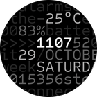 <br> [Text Lines](./src/watchfaces/text-lines/) | 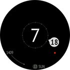 <br> [Spin](./src/watchfaces/spin/) | 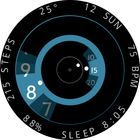 <br> [Gauge](./src/watchfaces/gauge/) |
| 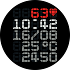 <br> [Bourne](./src/watchfaces/bourne/) | 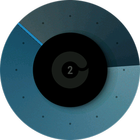 <br> [Celeste](./src/watchfaces/celeste/) | 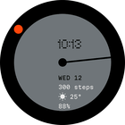 <br> [Nothing Dial](./src/watchfaces/nothing-dial/) |
| 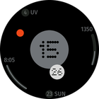 <br> [Spin 2](./src/watchfaces/spin-2/) | 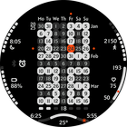 <br> [11 weeks](./src/watchfaces/11-weeks/) |  <br> [Verbarius](./src/watchfaces/verbarius/) |
| 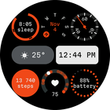 <br> [Elaborate](./src/watchfaces/elaborate/) | 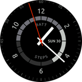 <br> [Sektor](./src/watchfaces/nothing-sector/) | 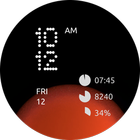 <br> [Solar circle](./src/watchfaces/solar-circle/) |
| 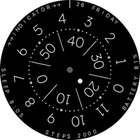 <br> [Anicorn K452 Nemesis](./src/watchfaces/anicorn-k452-nemesis/) | 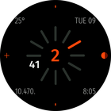 <br> [Spin 3](./src/watchfaces/spin-3/) | 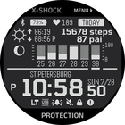 <br> [X-Shock](./src/watchfaces/x-shock/) |
| 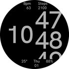 <br> [Grotesque](./src/watchfaces/grotesque/) | 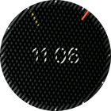 <br> [Time Machine](./src/watchfaces/time-machine/) | 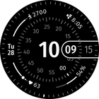 <br> [Concentric Data](./src/watchfaces/concentric-data/) |
| 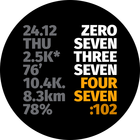 <br> [Opposite Time](./src/watchfaces/opposite-time/) | 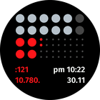 <br> [Sometimes](./src/watchfaces/sometimes/) | 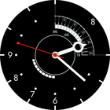 <br> [Rider 1991](./src/watchfaces/rider-1991/) |
| 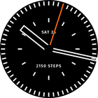 <br> [Kinetik](./src/watchfaces/kinetik/) | 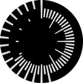 <br> [Repelling Radial](./src/watchfaces/repelling-radial/) | 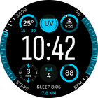 <br> [Modular](./src/watchfaces/modular/) |
| 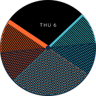 <br> [Ara](./src/watchfaces/ara/) | 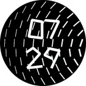 <br> [Symmetry Broken](./src/watchfaces/symmetry-broken/) | 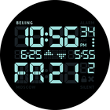 <br> [Regulus](./src/watchfaces/regulus/) |
| 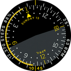 <br> [Horizon](./src/watchfaces/horizon/) | 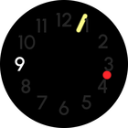 <br> [Circlock](./src/watchfaces/circlock/) | 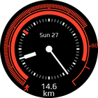 <br> [Needle](./src/watchfaces/needle/) |
| 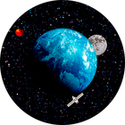 <br> [Astro](./src/watchfaces/astro/) | 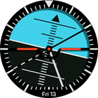 <br> [Gyroscope](./src/watchfaces/gyroscope/) | 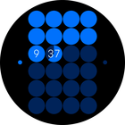 <br> [Slices of Time](./src/watchfaces/slices-of-time/) |
| 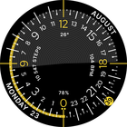 <br> [Horizon 2](./src/watchfaces/horizon-2/) | 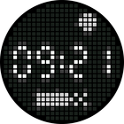 <br> [Glyph Matrix](./src/watchfaces/glyph-matrix/) | 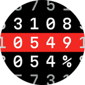 <br> [Enigma](./src/watchfaces/enigma/) |
| 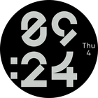 <br> [Typeface](./src/watchfaces/typeface/) | 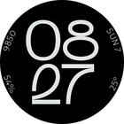 <br> [Typeface 2](./src/watchfaces/typeface-2/) | 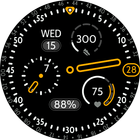 <br> [Corsa](./src/watchfaces/corsa/) |
| 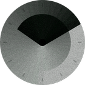 <br> [Gradient Watch](./src/watchfaces/gradient-watch/) | 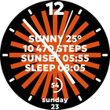 <br> [Asterisk Artclock](./src/watchfaces/asterisk-artclock/) | 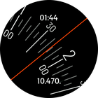 <br> [Nonius](./src/watchfaces/nonius/) |
| 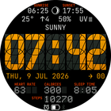 <br> [Segment 34](./src/watchfaces/segment-34/) | 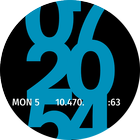 <br> [Outbound](./src/watchfaces/outbound/) | 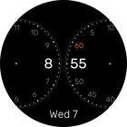 <br> [Gear Time](./src/watchfaces/gear-time/) |
| 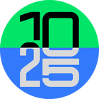 <br> [Flux](./src/watchfaces/flux/) | 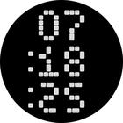 <br> [Fluid Pixels](./src/watchfaces/fluid-pixels/) | 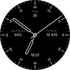 <br> [Regarder](./src/watchfaces/regarder/) |
| 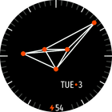 <br> [atan2](./src/watchfaces/atan2/) | 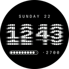 <br> [Echo](./src/watchfaces/echo/) | 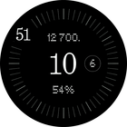 <br> [Spin 4](./src/watchfaces/spin-4/) |
| 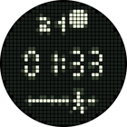 <br> [Glyph Matrix 2](./src/watchfaces/glyph-matrix-2/) | 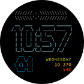 <br> [ASCII](./src/watchfaces/ascii/) | 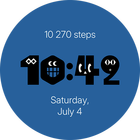 <br> [The Unlikeables](./src/watchfaces/unlikeables/) |
| 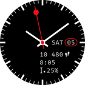 <br> [Nothing Clock](./src/watchfaces/nothing-clock/) | | |

## Repository Structure

```text
├── scripts/                  # Build and release scripts
├── src/
│   ├── adapters/             # Helpers for working with Zepp OS APIs
│   ├── types/                # Zepp OS type declarations
│   ├── utils/                # Shared utility functions
│   └── watchfaces/           # One mini-project per watchface
│       └── <watchface>/
│           ├── assets/       # Images, fonts, and other resources
│           ├── page/         # Settings and translations, when used
│           ├── utils/        # Watchface-specific helpers
│           ├── watchface/    # Watchface source code
│           ├── app.js
│           ├── app.json
│           └── README.md
├── jsconfig.json
├── package.json
└── README.md
```

## Installing a Watchface

### Option 1: Official Store (Easiest)

1. Open the Zepp app and look for the watchface in the official store. Most of the watchfaces in this repository are available there, but the store does not currently provide search or direct links.
2. Install the watchface from the store.

### Option 2: Unofficial Store

1. Open the [unofficial Zepp watchface catalog](https://mmk.pw/en/zepp_explorer/explorer/watch/?filters=%7B%22publisher%22:%201640%7D). Some watchfaces from the official store are added there automatically.
2. Download the watchface or use the provided QR code.

### Option 3: ZIP File

This option works on older Zepp OS versions that allow mini-apps to be installed from ZIP files.

1. Open the repository’s [Releases page](https://github.com/novvember/amazfit-watchfaces/releases).
2. Download the latest ZIP file for your watch model:

   - **Amazfit GTR Mini (default):** `...-MHS-416x416.zip`
   - **Amazfit GTR 4:** `...-NXP-466x466.zip`
   - **Amazfit GTR 3:** `...-NXP-454x454.zip`
   - **Amazfit GTR 3 Pro:** `...-NXP-480x480.zip`

3. Copy the file to your phone.
4. Install it from your phone’s storage using a compatible app.

### Option 4: QR Code

1. Download the ZIP file as described above.
2. Convert the ZIP file to a ZPK file using a compatible tool, then generate a QR code for it.
3. Enable developer mode in the Zepp app and scan the QR code to install the watchface.

### Important Notes

- Some watchfaces use custom fonts. Custom fonts require Zepp OS 2 or later and do not work on older models such as the GTR 3 and GTR 3 Pro.
- If a custom font does not appear correctly after installation, restart the watch.

## Development

### Getting Started

- Follow the [official Zepp OS quick start guide](https://docs.zepp.com/docs/guides/quick-start/).
- Install Node.js. If the CLI does not work, try a different Node.js version.
- Install Python 3 (`python3`) to prepare device ZIPs after building. Their names use `cpuPlatform` and `screenResolution` from the ZAB manifest.
- Install the Zepp OS CLI globally so the `zeus` command is available:

  ```sh
  npm install --global @zeppos/zeus-cli
  ```

### Useful Links

- [Zepp OS Watchface API](https://docs.zepp.com/docs/watchface/api/hmUI/createWidget/)
- [Official Watchface Maker](https://watchface.zepp.com/create)
- [GTR 4 watchface community on 4PDA](https://4pda.to/forum/index.php?showtopic=1055207)
