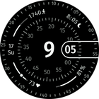

# Watchfaces for Amazfit Smartwatches

Here you will find various watchfaces I designed for the Amazfit GTR Mini with a resolution of 416x416 px. Several of these watchfaces are adaptive, making them compatible with any device that features a round display. Additional details are available below.

## Repository Structure

This repository contains multiple folders, each dedicated to a different watchface design.

## Watchfaces Gallery

| Image 	                               | Name       	          | Devices supported | Development Status 	  |
|:-------------------------:            |------------           |------------------ |---------------------    |
|             | Text Lines 	          | GTR Mini only 	   | ✅ Done             	|
|        	          | Spin       	          | GTR Mini only 	   | ✅ Done             	|
|              | Particles  	          | GTR Mini only 	   | 🚫 Has issues          |
|       	          | Gauge      	          | GTR Mini only 	   | ✅ Done             	|
|                 | Bourne     	          | All round watches | ✅ Done             	|
|                | Celeste    	          | All round watches | ✅ Done             	|
|           | Nothing Dial          | All round watches | ✅ Done             	|
|                 | Spin 2                | All round watches | ✅ Done             	|
|               | 11 weeks              | All round watches | ✅ Done             	|
|         | Nothing Glyphs        | All round watches | ✅ Done             	|
|              | Verbarius             | All round watches | ✅ Done             	|
|              | Elaborate             | All round watches | ✅ Done             	|
|         | Sektor                | All round watches | ✅ Done             	|
|           | Solar circle          | All round watches | ✅ Done             	|
|   | Anicorn K452 Nemesis  | All round watches | ✅ Done             	|
|                 | Spin 3                | All round watches | ✅ Done             	|
|                | G-Shock               | All round watches | ✅ Done                |
|              | Grotesque             | All round watches | ✅ Done                |
|           | Time Machine          | All round watches | ✅ Done                |
|        | Concentric Data       | All round watches | ✅ Done                |
|          | Opposite Time         | All round watches | ✅ Done                |
|              | Sometimes             | All round watches | ✅ Done                |

## Installation Instructions

To add a new watchface to your device:

1. Visit the [releases page](https://github.com/novvember/amazfit-watchfaces/releases) of this repository.

2. Download the latest release by selecting the appropriate `.zip` file for your smartwatch model from the list below:

   - **Default:** Amazfit GTR Mini - `...-MHS-416x416.zip`

   - Amazfit GTR 4 - `...-NXP-466x466.zip`

   - Amazfit GTR 3 - `...-NXP-454x454.zip`

   - Amazfit GTR 3 Pro - `...-NXP-480x480.zip`

3. Transfer the downloaded file to your smartphone.

4. Utilize any compatible app to install the watchface from your phone's internal storage.

### Important Notes!
- Some texts are displayed with custom fonts. It requires devices with ZeppOS 2 and higher and is not compatible with older models like the GTR 3 and GTR 3.

- Please restart the watch after installation to ensure proper font display.

## Development Resources

### Useful Links

- [Zepp OS Watchface API](https://docs.zepp.com/docs/watchface/api/hmUI/createWidget/)

- [Official Watchface Maker](https://watchface.zepp.com/create)

- [GTR 4 Watchface Community on 4pda.to](https://4pda.to/forum/index.php?showtopic=1055207)

### Getting Started

- [Quick start guide](https://docs.zepp.com/docs/guides/quick-start/)
