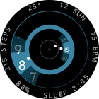
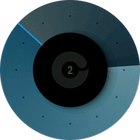
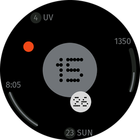

# Watchfaces for Amazfit Smart Watch

Different watchfaces I developed for my Amazfit GTR Mini (416x416 px). Some watchfaces are developed to be adaptive so the code can run on all devices with round screen (see detailes below).

## Development

### References

- [Zepp OS Watchface API](https://docs.zepp.com/docs/watchface/api/hmUI/createWidget/)

- [Official Watchface Maker](https://watchface.zepp.com/create)

- [GTR 4 Watchface Community on 4pda.to](https://4pda.to/forum/index.php?showtopic=1055207)

### How to Start Development

- [Quick start guide](https://docs.zepp.com/docs/guides/quick-start/)

## File Structure

This repositity has several folders -- one folder for one watchface

## How to Install a Watchface on Your Watch

To install a watchface to your smartwatch:

1. Go to [all releases page](https://github.com/novvember/amazfit-watchfaces/releases)

2. Find latest release, download `.zip` file and transfer it to your phone

3. Use any app, which can install Amazfit watchfaces from phone internal storage

## List of Watchfaces

| Image 	                    | Name       	| Devices supported | Development Status 	  |
|:-------------------------:  |------------ |------------------ |---------------------  |
|   | Text Lines 	| GTR Mini only 	  | ✅ Done             	|
|        	| Spin       	| GTR Mini only 	  | ✅ Done             	|
|    | Particles  	| GTR Mini only 	  | 🚫 Has issues        |
|       	| Gauge      	| GTR Mini only 	  | ✅ Done             	|
|       | Bourne     	| GTR Mini only 	  | ✅ Done             	|
|      | Celeste    	| GTR Mini only 	  | ✅ Done             	|
| | Nothing Dial| GTR Mini only 	  | ✅ Done             	|
|       | Spin 2      | GTR Mini only 	  | ✅ Done             	|
|     | 11 weeks    | All round watches | ✅ Done             	|
