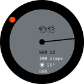
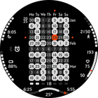
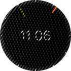
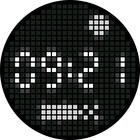
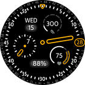

# Watchfaces for Amazfit Smartwatches

Here you'll find a variety of watchfaces I've designed for my round Amazfit watch. Some are my original creations, while others are inspired by designs I've seen on other devices or images online, and I've developed them for Zepp OS.

Most of these watchfaces are adaptive, ensuring compatibility with any device featuring a round display. Additionally, most require ZeppOS 2 or higher. Further details are available below.

## Bug Reports, Support, and Feature Requests

I strive to ensure that my watchfaces are as bug-free as possible, but issues can still arise. It's also challenging to test them across all possible watch models and operating system versions.

If you discover a bug or want to share your experience with my watchfaces, feel free to reach out:

- Create an issue in the adjacent section here: https://github.com/novvember/amazfit-watchfaces/issues

- Email me directly: n.demitsuri@gmail.com

## Donations

All of my watchfaces are free to use. However, if you'd like to support further development or simply say thank you, you can make a donation: https://boosty.to/novvember/donate

## Watchfaces Gallery

| | | | |
|:---:|:---:|:---:|:---:|
|    [Text Lines](./text-lines/) |    [Spin](./spin/) |    [Gauge](./gauge/) |    [Bourne](./bourne/) |
|    [Celeste](./celeste/) |    [Nothing Dial](./nothing-dial/) |    [Spin 2](./spin-2/) |    [11 weeks](./11-weeks/) |
|    [Verbarius](./verbarius/) |    [Elaborate](./elaborate/) |    [Sektor](./nothing-sector/) |    [Solar circle](./solar-circle/) |
|    [Anicorn K452 Nemesis](./anicorn-k452-nemesis/) |    [Spin 3](./spin-3/) |    [X-Shock](./x-shock/) |    [Grotesque](./grotesque/) |
|    [Time Machine](./time-machine/) |    [Concentric Data](./concentric-data/) |    [Opposite Time](./opposite-time/) |    [Sometimes](./sometimes/) |
|    [Rider 1991](./rider-1991/) |    [Kinetik](./kinetik/) |    [Repelling Radial](./repelling-radial/) |    [Modular](./modular/) |
|    [Ara](./ara/) |    [Symmetry Broken](./symmetry-broken/) |    [Regulus](./regulus/) |    [Horizon](./horizon/) |
|    [Circlock](./circlock/) |    [Needle](./needle/) |    [Astro](./astro/) |    [Gyroscope](./gyroscope/) |
|    [Slices of Time](./slices-of-time/) |    [Horizon 2](./horizon-2/) |    [Glyph Matrix](./glyph-matrix/) |    [Enigma](./enigma/) |
|    [Typeface](./typeface/) |    [Typeface 2](./typeface-2/) |    [Corsa](./corsa/) |    [Gradient Watch](./gradient-watch/) | 
|    [Asterisk Artclock](./asterisk-artclock/) |    [Nonius](./nonius/) | | | 

## Repository Structure

This repository contains multiple folders, each dedicated to a different watchface design.

## Installation Instructions

### Variant 1: Official Store (Easy)

1. Locate the watchface in the official Zepp store via the Zepp app. Most of these watchfaces are available there. But there is no search or direct links :(

2. Install it directly from the store.

### Variant 2: Unofficial Store (A Bit More Complex)

1. Visit the unofficial Zepp repository where some of my watchfaces previously available in the official store are automatically added:  
https://mmk.pw/en/zepp_explorer/explorer/watch/?filters=%7B%22publisher%22:%201640%7D

2. Download the watchface or use the QR code provided.

### Variant 3: Zip File Installation (Medium Complexity)

This method is suitable for older versions of Zepp OS where you can install a side app using a zip file.

1. Visit the [releases page](https://github.com/novvember/amazfit-watchfaces/releases) of this repository.

2. Download the latest release by selecting the appropriate `.zip` file for your smartwatch model from the list below:

   - **Default:** Amazfit GTR Mini - `...-MHS-416x416.zip`

   - Amazfit GTR 4 - `...-NXP-466x466.zip`

   - Amazfit GTR 3 - `...-NXP-454x454.zip`

   - Amazfit GTR 3 Pro - `...-NXP-480x480.zip`

3. Transfer the downloaded file to your smartphone.

4. Utilize any compatible app to install the watchface from your phone's internal storage.

### Variant 4: QR Code Installation (More Complex)

1. Find and download the zip file as described in the previous variant.

2. Search online for a method to convert the zip file to a zpk file, then generate a QR code.

3. Use the QR code to install the watchface in developer mode within the Zepp app.

### Important Notes!
- Some texts are displayed with custom fonts. It requires devices with ZeppOS 2 and higher and is not compatible with older models like the GTR 3 and GTR 3 Pro.

- Please restart the watch after installation to ensure proper font display.

## Development Resources

### Useful Links

- [Zepp OS Watchface API](https://docs.zepp.com/docs/watchface/api/hmUI/createWidget/)

- [Official Watchface Maker](https://watchface.zepp.com/create)

- [GTR 4 Watchface Community on 4pda.to](https://4pda.to/forum/index.php?showtopic=1055207)

### Getting Started

- [Quick start guide](https://docs.zepp.com/docs/guides/quick-start/)
