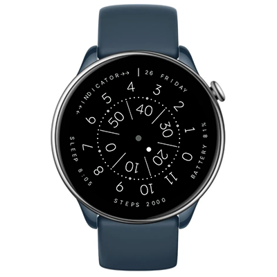

# Anicorn K452 Nemesis
Watchface for Amazfit GTR Mini and other round ZeppOS watches

## Features

**Main features**
- Time is displayed using rotating disks for hours, minutes, and seconds (shown as 3:42 in the screenshot above).
- Additional information is conveniently displayed on the bezel, including the date and weekday, battery level, step counter, and sleep time.

**Inspired by**
- [ANICORN Series K452 Space Automatic Watches - Nemesis](https://www.anicorn-watches.com/products/k452-nemesis)

**Model compatibility:** Amazfit GTR Mini (round, 416 x 416 pixels) / GTR 4 / T-Rex 2 and other round watches

**AOD:** No

**Tap-zones:** No

**Language:** English

## Download ⏬

See instructions [here](https://github.com/novvember/amazfit-watchfaces/blob/main/README.md) to download and install to your watch.
