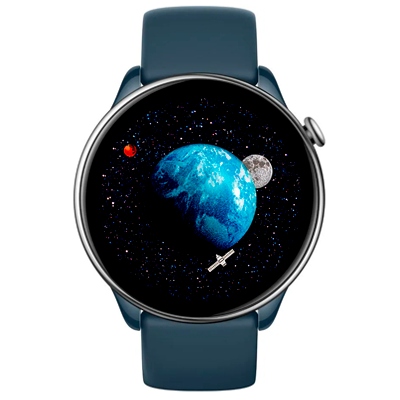

# Astro Watchface
Watchface for Amazfit GTR Mini and for other round ZeppOS watch.

## Features
Astronomic watchface with Earth, Moon, Mars representing current time.

**Main features**
- Time  (hours, minutes, seconds)

**Original idea by:**
[Bell & Ross BR-03 Astro watch](https://www.bellross.com/eu/en-gb/br-03-astro-rubber-strap?srsltid=AfmBOoq-GW6JwquXvod_XDQrLE7RL9TLPVfw_VZGalRdUhtZeWXuGvdO)

**Model compatibility:** Amazfit GTR Mini, Amazfit GTR 4 and all other round ZeppOS watches

**AOD:** Yes

**Tap-zones:** No

**Language:** All.

## Download ⏬

To install it to your smartwatch:

See instructions [here](https://github.com/novvember/amazfit-watchfaces/blob/main/README.md) to download and install to your watch.
