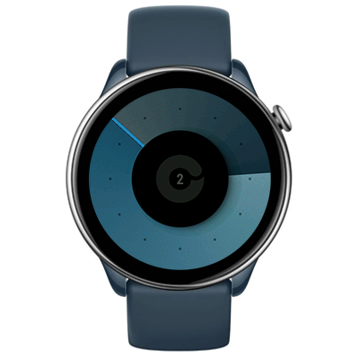

# Celeste Watchface
Watchface for ZeppOS wathces

## Features

**Main features**
- Inspired by [ZIIIRO Celeste analog watch](https://www.ziiiro.com/shop/celeste-black-mono/)
- Time is indicated by gradients (for example, it's 02:52 in the screen above)
- Central progress circle for steps
- Date display in the center

**Model compatibility:** Amazfit GTR Mini, GTR 4, GTR 3 Pro, T-Rex 2 and other round ZeppOS watches

**AOD:** Yes

**Tap-zones:** No

**Language:** All

## Download ⏬

See instructions [here](https://github.com/novvember/amazfit-watchfaces/blob/main/README.md) to download and install to your watch.
