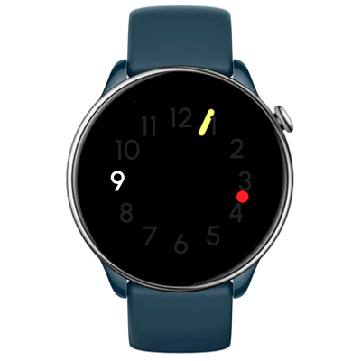

# Circlock Watchface
Watchface for round ZeppOS watch.

## Features

**Main features**
- Analogue time (hour/minute/second).
- AOD

**Original idea by:**
Designer Edoardo Gouffran and their [conceptual 'Circlock' watch](https://www.behance.net/gallery/132319107/Circlock-Watch).

**Model compatibility:** Amazfit GTR Mini, Amazfit GTR 4 and all other round ZeppOS watches (Zepp OS 2+).

**Language:** Universal.

## Download ⏬

To install it to your smartwatch:

See instructions [here](https://github.com/novvember/amazfit-watchfaces/blob/main/README.md) to download and install to your watch.
