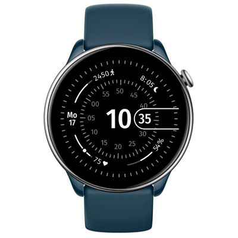

# Concentric Data Watchface
Watchface for Amazfit GTR Mini and for other round ZeppOS watch.

## Features

**Main features**
- sliding minutes
- date and weekday
- step counter
- sleep time or sunrise/sunset time if no sleep data
- heart rate
- battery level
- connection status

**Model compatibility:** Amazfit GTR Mini, Amazfit GTR 4 and all other round ZeppOS watches

**Note: It requires devices with ZeppOS 2 and higher and is not compatible with older models like the GTR 3 and GTR 3.**

**AOD:** Yes

**Tap-zones:** No

**Language:** English, Russian

**Inspired:** [Famous Concentric Watchface for Pixel Watches](https://play.google.com/store/apps/details?id=com.watchfacedesigns.Concentric)

## Download ⏬

To install it to your smartwatch:

See instructions [here](https://github.com/novvember/amazfit-watchfaces/blob/main/README.md) to download and install to your watch.
