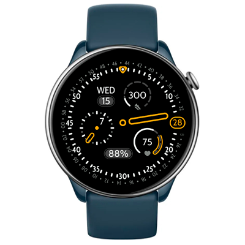

# Corsa Watchface
Watchface for Amazfit GTR Mini and for other round ZeppOS watch.

## Features

**Main features**

This watch face takes cues from the innovative Ressence watches and Material Design. The entire center dial rotates with the minute hand. It packs all essentials in one view: time, date, battery, steps, and heart rate.

**Inspiration**  
- [Ressence Watch](https://ressencewatches.com/pages/watches)  
- Corsa watchface presented with Pixel Watch 4

**Model compatibility:** Amazfit GTR Mini, Amazfit GTR 4 and all other round ZeppOS watches

**Note: Time text requires devices with ZeppOS 2 and higher and is not compatible with older models like the GTR 3 and GTR 3.**

**AOD:** No

**Tap-zones:** No

**Language:** English, Russian

## Download ⏬

To install it to your smartwatch:

See instructions [here](https://github.com/novvember/amazfit-watchfaces/blob/main/README.md) to download and install to your watch.
