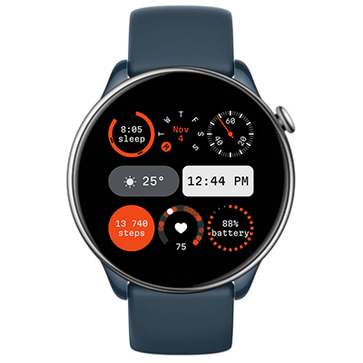

# Elaborate
Watchface for Amazfit GTR Mini and other round ZeppOS watches.

## Features

**Main features**

This watchface offers a variety of indicators with different views:
- Time display in both 24-hour and AM/PM formats
- Current weather (icon + temperature)
- Total sleep time, including start and end times indication
- Current day, month, and weekday
- Small clock with a second hand
- Step target progress indicator
- Latest heart rate measurement
- Battery level
- Bluetooth disconnection alert (icon displayed when connection is lost)

**Inspired by**
One of the default watchfaces for CMF by Nothing Watch [Elaborate 2](https://intl.cmf.tech/pages/watch-pro)

**Weather icons**
- [QWeather Icons](https://github.com/qwd/Icons)

**Model compatibility:** Amazfit GTR Mini (round, 416 x 416 pixels) / GTR 4 / T-Rex 2 and other round watches with ZeppOS 2+

**AOD:** Yes

**Tap-zones:** No

**Language:** English, Russian

## Download ⏬

See instructions [here](https://github.com/novvember/amazfit-watchfaces/blob/main/README.md) to download and install to your watch.
