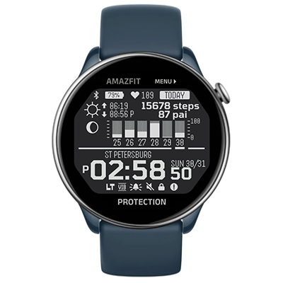

# G-Shock Watchface
Watchface for Amazfit GTR Mini and for other round ZeppOS watch.

## Features

**Main features**
- time with seconds and 12/24 time format support
- city name
- status icons for enabled vibration, alarm, do not disturb mode, screen lock, low battery level, connection status
- battery level
- last heart rate measurement
- current steps value
- current pai value
- pai value for 6 latest days
- sunrise/sunset time
- moon phase

**Model compatibility:** Amazfit GTR Mini, Amazfit GTR 4 and all other round ZeppOS watches

**AOD:** No

**Tap-zones:** No

**Language:** English

**Inspired:** Casio G-Shockwatches design

## Download ⏬

To install it to your smartwatch:

See instructions [here](https://github.com/novvember/amazfit-watchfaces/blob/main/README.md) to download and install to your watch.
