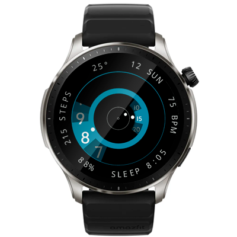

# Gauge Watchface
Watchface for Amazfit GTR Mini

## Features

**Main features**
- hour and minute time scales are mostly hidden, only current time parts are visisible,
- hour hand, minute hand and second hand to indicate current time
- additional info on the side: date, weekday, heart rate, sleep time, battery level, step counter, current weather.

**Model compatibility:** Amazfit GTR Mini (round, 416 x 416 pixels) / GTR 4 / T-Rex 2 and other round watches

**AOD:** No

**Tap-zones:** No

**Language:** English, Russian

## Download ⏬

See instructions [here](https://github.com/novvember/amazfit-watchfaces/blob/main/README.md) to download and install to your watch.
