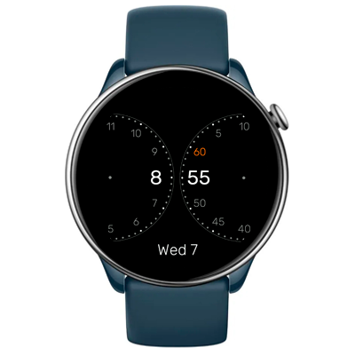

# Outbound Watchface
Watchface for Amazfit GTR Mini and for other round ZeppOS watch.

## Features

**Main features**

A minimalist design watchface where hours and minutes are formed by two counter-rotating discs. Includes full AOD.

**Original design**  
[Sabo Sugi concept](https://x.com/i/status/1995212202811527232)

**Model compatibility:** Amazfit GTR Mini, Amazfit GTR 4 and all other round ZeppOS watches

**AOD:** Yes

**Tap-zones:** No

**Language:** English, Russian

## Download ⏬

To install it to your smartwatch:

See instructions [here](https://github.com/novvember/amazfit-watchfaces/blob/main/README.md) to download and install to your watch.
