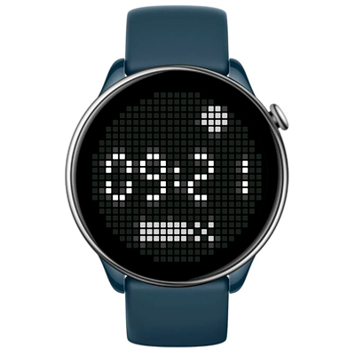

# Glyph Matrix Watchface
Watchface for round ZeppOS watch.

## Features
Simple pixel watchface with a configurable complications.

**Main features**
- Top line:
  - Sum position during the daylight (can be disabled in the settings).
  - Bluetoothe disconnection status.
- Center line:
  - Time.
- Bottom line (can be configured with settings screen):
  - steps progress bar,
  - or date,
  - or battery level,
  - or weather,
  - or heart rate,
  - or nothing.
- AOD (only time).

**Inspired by:**
[Glyphs screen on Nothing Phone 3](https://intl.nothing.tech/products/phone-3?Colour=White&Capacity=12%2B256GB).

**Model compatibility:** Amazfit GTR Mini, Amazfit GTR 4 and all other round ZeppOS watches (Zepp OS 2+).

**Language:** English, Russian.

## Download ⏬

To install it to your smartwatch:

See instructions [here](https://github.com/novvember/amazfit-watchfaces/blob/main/README.md) to download and install to your watch.
