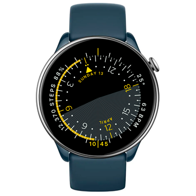

# Ara Watchface
Watchface for round ZeppOS watch.

## Features

**Main features**
- Time is indicated by a rotating 24-hour time disk that represents the entire day, with the grey area indicating daylight hours and the yellow zone designating sleeping hours. A vertical line at the bottom shows the current time on the disk.
- Additional information:
  - Digital time display beneath the disk's current time line
  - Step counter
  - Battery level indicator
  - Outside temperature
  - Heart rate monitor
  - Date and weekday display
  - Month display

**Original design:**
[Optik Instruments Horizon watch](https://watchcomplications.com/2019/04/14/optik-instruments-horizon/).

**Model compatibility:** Amazfit GTR Mini, Amazfit GTR 4 and all other round ZeppOS watches

**AOD:** No

**Tap-zones:** No

**Language:** English, Russian.

## Download ⏬

To install it to your smartwatch:

See instructions [here](https://github.com/novvember/amazfit-watchfaces/blob/main/README.md) to download and install to your watch.
