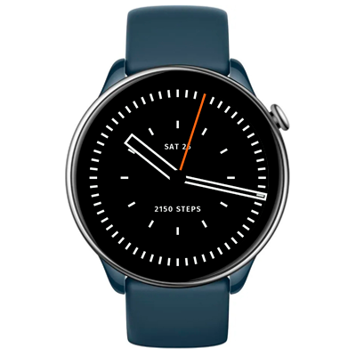

# Kinetic Watchface
Watchface for Amazfit GTR Mini and for other round ZeppOS watch.

## Features

**Main features**
- Time
- Date
- Editable additional info
  - steps
  - heart rate
  - sleep time
  - calories
  - distance
  - battery level
  - outside temperature

**Original watchface by:**

[Defakto Kinetik](https://www.defakto-watches.com/watches/kinetik/standard/471/).

**Model compatibility:** Amazfit GTR Mini, Amazfit GTR 4 and all other round ZeppOS watches

**Note: Time text requires devices with ZeppOS 2 and higher and is not compatible with older models like the GTR 3 and GTR 3.**

**AOD:** Yes

**Tap-zones:** No

**Language:** English, Russian

## Download ⏬

To install it to your smartwatch:

See instructions [here](https://github.com/novvember/amazfit-watchfaces/blob/main/README.md) to download and install to your watch.
