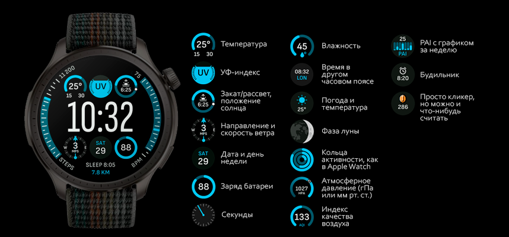

# Modular Watchface
Watchface for round ZeppOS watch.

## Features

**Main features**
- Large time digits in the center.
- Steps and heart rate on the sides.
- Walked distance and sleep duration on the bottom.
- Six customizable widget slots:
  - Temperature
  - UV Index
  - Sun position and sunrise/sunset time
  - Wind speed and direction
  - Date and weekday
  - Battery level
  - Second hand
  - Humidity
  - World time (time for the first city in the system app)
  - Current weather status and temperature
  - Moon phase
  - Activity rings (calories, fat-burning time, and stands)
  - Air pressure
  - Air Quality Index
  - Weekly PAI value with diagram for the last 7 days
  - Alarm time
  - Coin clicker (count things in real time or just click it to get a coin)
  - Or simply disable any widget to have extra space

**Reference:**
[Modular Ultra watchface](https://support.apple.com/guide/watch/faces-and-features-apde9218b440/watchos) for Apple Watch Ultra in one of its possible configurations.

**Model compatibility:** Amazfit GTR Mini, Amazfit GTR 4 and all other round ZeppOS watches

**AOD:** Yes

**Tap-zones:** No

**Language:** English, Russian

## Download ⏬

To install it to your smartwatch:

See instructions [here](https://github.com/novvember/amazfit-watchfaces/blob/main/README.md) to download and install to your watch.
