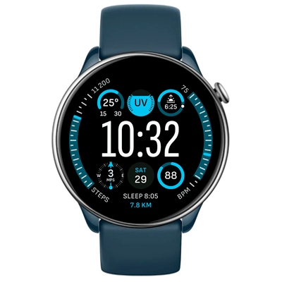

# Modular Watchface
Watchface for Amazfit GTR Mini and for other round ZeppOS watch.

## Features

**Main features**
- Time
- Date and weekday
- Personal data
  - steps
  - heart rate (last measurement, minimum/maximum of today measurements)
  - sleep time
  - distance
- Weather
  - outdoor temperature (current, minimum/maximum for today)
  - UV index
  - sun position, day length and closest sunrise/sunset time
  - wind direction and speed
- Battery level

**Reference:**
[Modular Ultra watchface](https://support.apple.com/guide/watch/faces-and-features-apde9218b440/watchos) for Apple Watch Ultra in one of its possible configurations.

**Model compatibility:** Amazfit GTR Mini, Amazfit GTR 4 and all other round ZeppOS watches

**AOD:** No

**Tap-zones:** No

**Language:** English, Russian

## Download ⏬

To install it to your smartwatch:

See instructions [here](https://github.com/novvember/amazfit-watchfaces/blob/main/README.md) to download and install to your watch.
