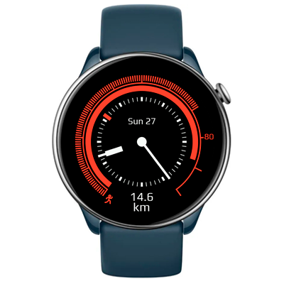

# Needle Watchface
Configurable sports watchface: Displays analog time and date at the center. Shows battery level progress on an inner scale. Features an editable outer scale for activity metrics such as steps, stand time, calories, and fat burning. Includes customizable bottom text information for details like steps, distance, heart rate, battery, and more.

## Features

**Main features**
- Analogue time (hour/minute/second).
- Date (day, weekday).
- Battery level (inner scale).
- Activity progress (configurable outer scale).
- Configurable digital data on the bottom (steps, distance, heart rate, etc),
- AOD

**Original idea by:**
One of default watchfaces of Suunto watch.

**Model compatibility:** Zepp OS 2+, round screen.

**Language:** English, Rsssian.

## Download ⏬

To install it to your smartwatch:

See instructions [here](https://github.com/novvember/amazfit-watchfaces/blob/main/README.md) to download and install to your watch.
