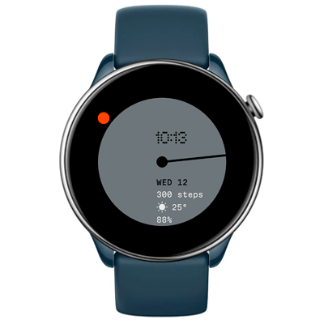

# Nothing Dial
Watchface for Amazfit GTR Mini and other round ZeppOS watches

## Features

**Main features**
- time is indicated by minute hand and 2 dots (orange one for hours, white one for seconds)
- digital time too
- date
- step counter
- current weather
- battery level
- status icon when watch is disconnected from phone

**Inspired by**
- [CMF by Nothing Watch default watchface](https://intl.cmf.tech/pages/watch-pro)

**Weather icons**
- [QWeather Icons](https://github.com/qwd/Icons)

**Model compatibility:** Amazfit GTR Mini (round, 416 x 416 pixels) / GTR 4 / T-Rex 2 and other round watches

**AOD:** Yes

**Tap-zones:** No

**Language:** English, Russian

## Download ⏬

See instructions [here](https://github.com/novvember/amazfit-watchfaces/blob/main/README.md) to download and install to your watch.
