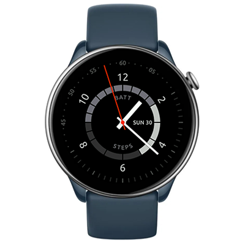

# Nothing Dial
Watchface for Amazfit GTR Mini and other round ZeppOS watches

## Features

**Main features**
- time with pointer clock
- battery level indicator
- step counter indicator
- date and weekday
- status icon when watch is disconnected from phone

**Inspired by**
- one of CMF by Nothing Watch 2 Pro default watchface

**Model compatibility:** Amazfit GTR Mini (round, 416 x 416 pixels) / GTR 4 / T-Rex 2 and other round watches

**AOD:** Yes

**Tap-zones:** No

**Language:** English, Russian

## Download ⏬

See instructions [here](https://github.com/novvember/amazfit-watchfaces/blob/main/README.md) to download and install to your watch.
