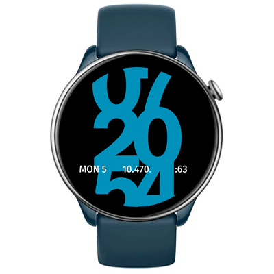

# Outbound Watchface
Watchface for Amazfit GTR Mini and for other round ZeppOS watch.

## Features

**Main features**

The bold, modern watchface with oversized digits that break the frame of the screen. It keeps things simple yet informative with key data: date, steps, and heart rate. AOD included.

**Reference watchfaces**  
- [IWF Neon Pulse watchface for wearOS](https://play.google.com/store/apps/details?id=com.watchfacestudio.iwf_neon_pulse),
- [BIGTTMM by TTMM for Fitbit watches](https://ttmm.is/portfolio/bigttmm/).

**Model compatibility:** Amazfit GTR Mini, Amazfit GTR 4 and all other round ZeppOS watches

**AOD:** Yes

**Tap-zones:** No

**Language:** English, Russian

## Download ⏬

To install it to your smartwatch:

See instructions [here](https://github.com/novvember/amazfit-watchfaces/blob/main/README.md) to download and install to your watch.
