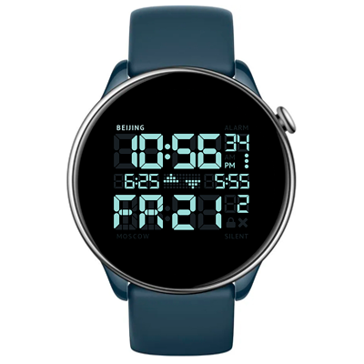

# Regulus Watchface
Watchface for Amazfit GTR Mini and for other round ZeppOS watch.

## Features

**Main features**
- Time in your current position.
- Date info.
- Battery level.
- Alarm status.
- Screen lock status.
- Bluetooth connection status.
- Additinal data (2 unites): sunset, sunrise, sleep time, heart rate, weather, steps, calories, distance.

**Reference:** Nixon Regulus watch

**Model compatibility:** Amazfit GTR Mini, Amazfit GTR 4 and all other round ZeppOS watches

**AOD:** Yes

**Tap-zones:** No

**Language:** English, Russian.

## Download ⏬

To install it to your smartwatch:

See instructions [here](https://github.com/novvember/amazfit-watchfaces/blob/main/README.md) to download and install to your watch.
