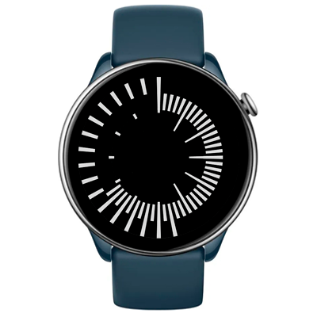

# Repelling Radial Watchface
Watchface for Amazfit GTR Mini and for other round ZeppOS watch.

## Features

**Main features**
- Time:
  - hours in the inner circle,
  - minutes in the middle circle,
  - seconds in the outter circle.

**Original idea by:**
Pattern design by [Audrey Esarey](https://www.cottonandbourbon.com/quilt-gallery).

**Model compatibility:** Amazfit GTR Mini, Amazfit GTR 4 and all other round ZeppOS watches

**AOD:** No

**Tap-zones:** No

**Language:** All

## Download ⏬

To install it to your smartwatch:

See instructions [here](https://github.com/novvember/amazfit-watchfaces/blob/main/README.md) to download and install to your watch.
