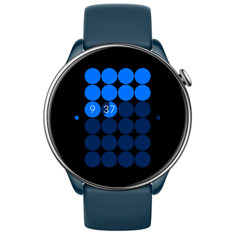

# Slices of Time Watchface
An abstract watch face that displays all 24 hours of the day on a single screen as gradually filling circles. It offers a striking visualization of the fleeting nature of time and invites reflection.

## Features

**Main features**
- Time (hours/minutes).
- AOD

**Original idea by:**  
[Slices of Time watchface by TTMM](https://ttmm.is/portfolio/5ttmm/)

**Model compatibility:** Zepp OS 2+, round screen.

**Language:** All.

## Download ⏬

To install it to your smartwatch:

See instructions [here](https://github.com/novvember/amazfit-watchfaces/blob/main/README.md) to download and install to your watch.
