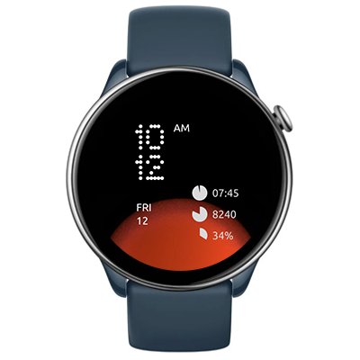

# Solar Circle
Watchface for Amazfit GTR Mini and other round ZeppOS watches

## Features

**Main features**
- Sun Movement Indicator: A red background circle represents the sun's movement during daylight (sunrise is at the bottom and sunset is at the top).
- Night Indicator: A similar blue circle represents night time.
- Time Display: Supports both 12-hour and 24-hour formats.
- Date and Weekday.
- Sleep time.
- Step сounter.
- Battery level.
- Status icon when watch is disconnected from phone

**Inspired by:** the Solar Circle watch face, a default option for the [CMF Watch Pro 2](https://intl.cmf.tech/pages/watch-pro-2)

**Model compatibility:**
Amazfit GTR Mini (round, 416 x 416 pixels), GTR 4, T-Rex 2, and other round watches. Note: It requires devices with ZeppOS 2 and higher and is not compatible with older models like the GTR 3 and GTR 3.

**AOD:** Yes

**Tap-zones:** No

**Language:** English, Russian

## Download ⏬

See instructions [here](https://github.com/novvember/amazfit-watchfaces/blob/main/README.md) to download and install to your watch.
