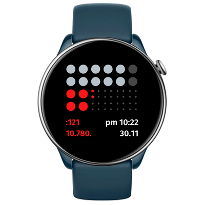

# Sometimes Watchface
Watchface for Amazfit GTR Mini and for other round ZeppOS watch.

## Features

**Main features**
- The top space is for 12 dots to reflect the hour.
- In the middle there are minutes. 1 small dot stands for 1 minute, 1 larger dot is a 5-minute period.
- At the bottom there are some text info
  - time
  - date
  - 2 extra data widgets to select.

**Editable options**
- Accent color
- Date format (with month or weekday)
- 2 sensor info widgets

**Legend**

`.` – steps

`*` – calories

`:` – heart rate

`%` – battery

**Original watchface by:**

TTMM studio and their [SUMTTMM watchface for Fitbit Versa](https://ttmm.is/portfolio/sumttmm/).

**Model compatibility:** Amazfit GTR Mini, Amazfit GTR 4 and all other round ZeppOS watches

**Note: Time text requires devices with ZeppOS 2 and higher and is not compatible with older models like the GTR 3 and GTR 3.**

**AOD:** No

**Tap-zones:** No

**Language:** English, Russian

## Download ⏬

To install it to your smartwatch:

See instructions [here](https://github.com/novvember/amazfit-watchfaces/blob/main/README.md) to download and install to your watch.
