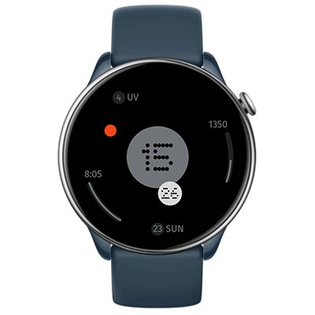

# Spin 2 Watchface
Watchface for Amazfit GTR Mini and for other round ZeppOS watch.

## Features

**Main features**
It is a combination of two other watchfaces -- orbit logic from *Spin* and cool colors and fonts from *Nothing Dial*.
- time: hour in center (12/24), minutes around, red dot for second hand
- date and day of the week
- steps
- sleep time
- UV index
- bluetooth connection status

**Model compatibility:** Amazfit GTR Mini, Amazfit GTR 4 and all oter round ZeppOS watches

**AOD:** Yes

**Tap-zones:** No

**Language:** English, Russian

**Inspired:** Radii Watch Face by The Design Cycle

## Download ⏬

To install it to your smartwatch:

See instructions [here](https://github.com/novvember/amazfit-watchfaces/blob/main/README.md) to download and install to your watch.
