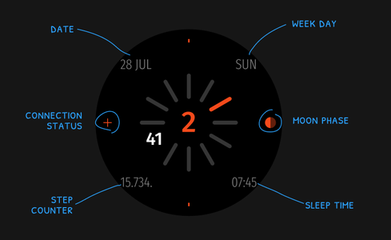

# Spin 3 Watchface
Watchface for Amazfit GTR Mini and for other round ZeppOS watch.

## Features

**Main features**
- time: hour in center (12/24), minutes around
- date, month and day of the week
- steps
- sleep time
- bluetooth connection status
- moon phase

**Model compatibility:** Amazfit GTR Mini, Amazfit GTR 4 and all other round ZeppOS watches

**AOD:** Yes

**Tap-zones:** No

**Language:** English, Russian

**Inspired:** [TTMMORE Watch Face by TTMM](https://ttmm.is/portfolio/ttmmore-vs/)

## Download ⏬

To install it to your smartwatch:

See instructions [here](https://github.com/novvember/amazfit-watchfaces/blob/main/README.md) to download and install to your watch.
