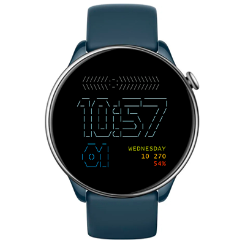

# ASCII Watchface
Watchface for round ZeppOS watch.

## Description
An ASCII art-inspired watchface, made entirely from font symbols. Time is shown in big digits and the date in smaller ones (fonts by Glenn Chappell). Other data includes the day of the week, steps, and battery level. A progress bar at the top shows the current sun position during daylight. AOD is also supported.

**Language:** English, RUssian

## Download ⏬

To install it to your smartwatch:

See instructions [here](https://github.com/novvember/amazfit-watchfaces/blob/main/README.md) to download and install to your watch.
