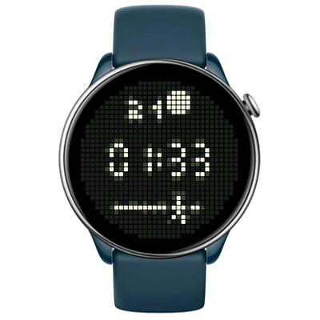

# Glyph Matrix 2 Watchface
Watchface for round ZeppOS watch.

## Description
A simple pixel-style watch face. The time is centered (with AOD support). The top section shows the date and the sun’s position throughout the day. The bottom section tracks your step progress.

Inspired by the Glyph interface on Nothing phones.

**Language:** Universal

## Download ⏬

To install it to your smartwatch:

See instructions [here](https://github.com/novvember/amazfit-watchfaces/blob/main/README.md) to download and install to your watch.
