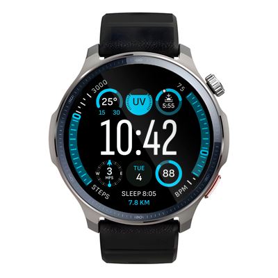

# Modular Watchface
Watchface for round ZeppOS watch.

## Description
Configurable watch face with rich data display. Six round customizable widget slots offer 15+ options (including weather, date, battery, alarm, moon phase, world time, and physical activity metrics). Time: regular or with seconds. Two additional widgets on the sides, and distance and sleep at the bottom. Supports AOD.

Restart your watch after installation to ensure proper display.

Find me on GitHub to report bugs, request features, or donate.

**Reference:**
[Modular Ultra watchface](https://support.apple.com/guide/watch/faces-and-features-apde9218b440/watchos) for Apple Watch Ultra in one of its possible configurations.

**Model compatibility:** Amazfit GTR Mini, Amazfit GTR 4 and all other round ZeppOS watches

**AOD:** Yes

**Tap-zones:** No

**Language:** English, Russian

## Download ⏬

To install it to your smartwatch:

See instructions [here](https://github.com/novvember/amazfit-watchfaces/blob/main/README.md) to download and install to your watch.
