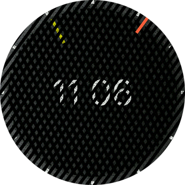

# Grotesque Watchface
Watchface for Amazfit GTR Mini and for other round ZeppOS watch.

## Features

**Main features**
- Time is displayed with shifting geometric patterns.
- The yellow-tipped bar represents the hour, while the orange-tipped one signifies the minutes.
- Additional marks can be enabled for more comfortable time reading.
- Time in digits can be enabled as well.

**Original idea by:**
Designer Daniel Duarte and his [Time Machine](https://design-milk.com/time-machine-by-daniel-duarte/).

**Model compatibility:** Amazfit GTR Mini, Amazfit GTR 4 and all other round ZeppOS watches

**Note: Time text- requires devices with ZeppOS 2 and higher and is not compatible with older models like the GTR 3 and GTR 3.**

**AOD:** No

**Tap-zones:** No

**Language:** All

## Download ⏬

To install it to your smartwatch:

See instructions [here](https://github.com/novvember/amazfit-watchfaces/blob/main/README.md) to download and install to your watch.
